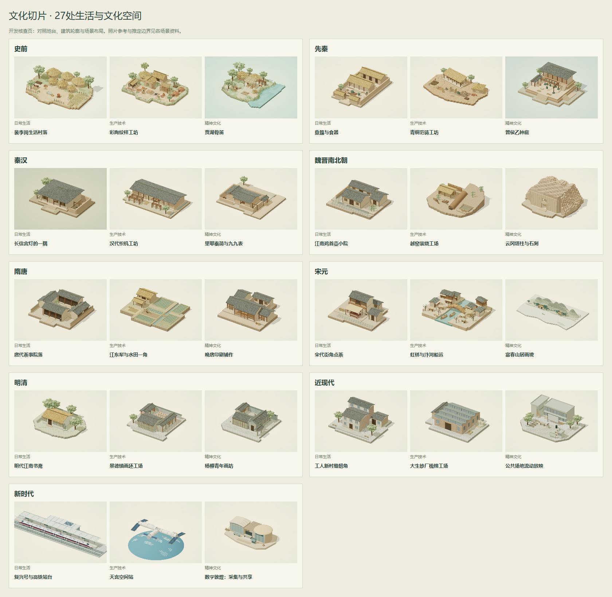
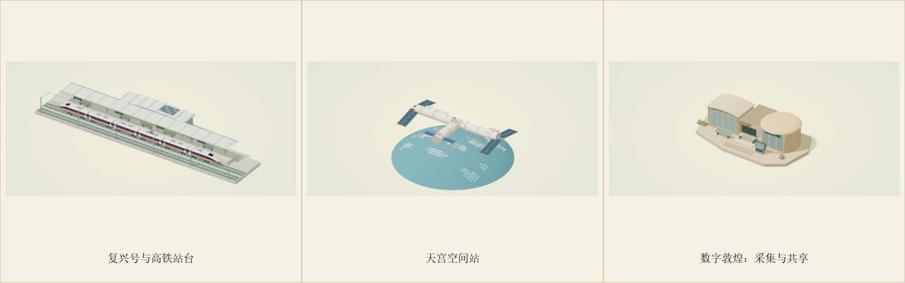
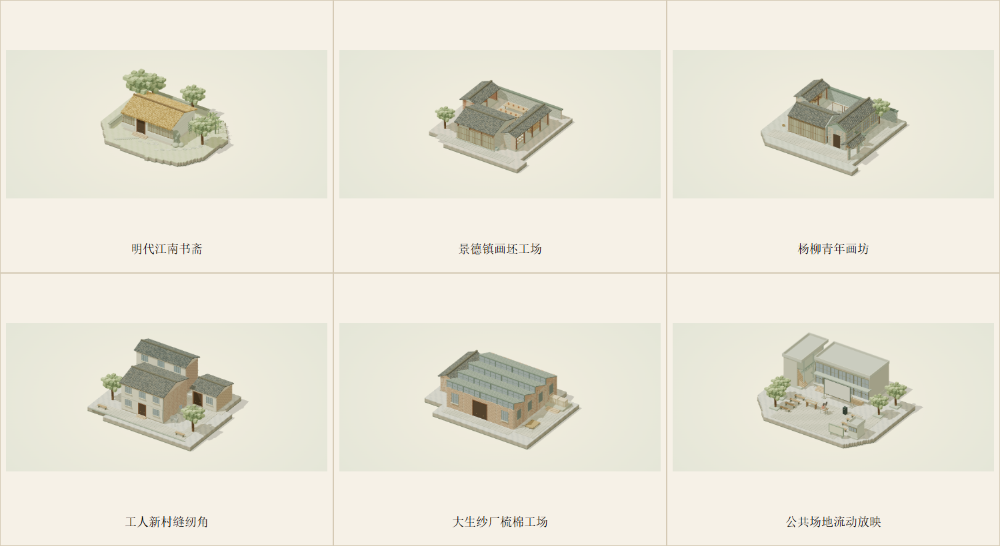
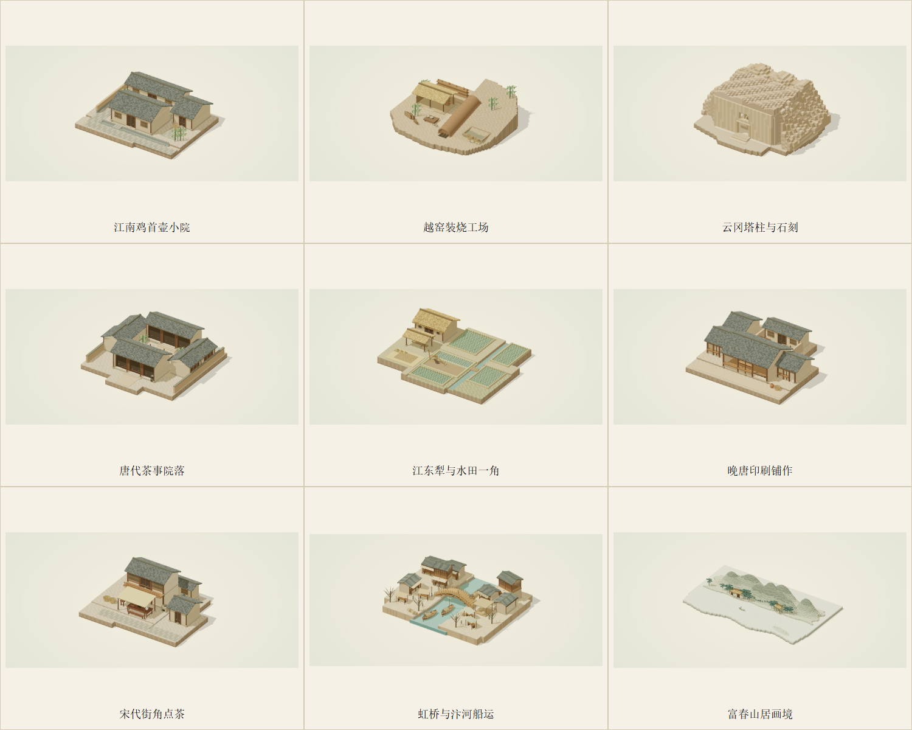
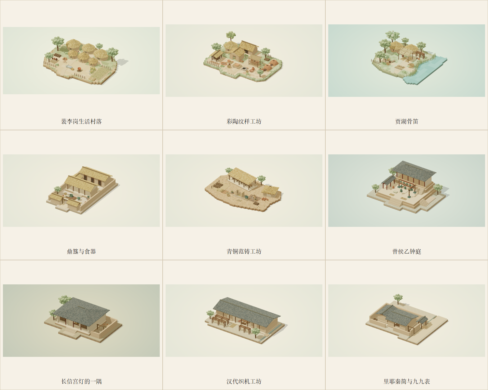
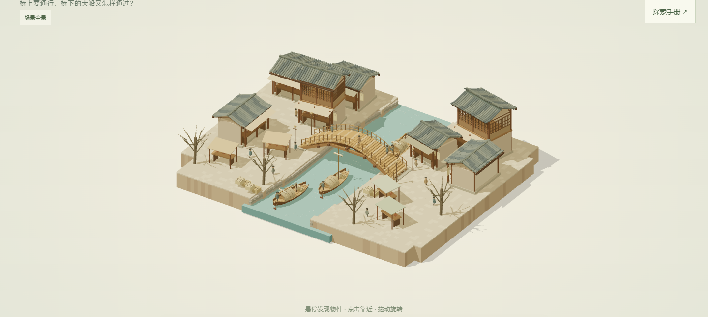
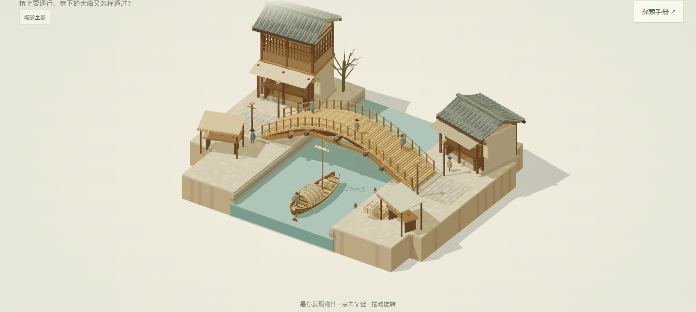

# 文化切片 · Culture Slices

**AIC 参赛作品 · AI+软件创新赛道**

以 AI 赋能传统文化，让历史与文物成为可以观察、操作和追问的生活场景。

[赛事官网](https://www.aicomp.cn/) · [需求说明](docs/需求说明.md) · [项目设计](docs/项目设计.md) · [迭代记录](docs/迭代记录.md)

文化切片是面向大学生与文化爱好者的三维文化探索网页。横向时间轴串联从史前到新时代的九个历史分组，每组围绕日常生活、生产技术、精神文化提供三个切片。进入微缩场景，观察器物、尝试操作，再向理解当前情境的 AI 向导追问。

> 一个切片讲清一个点，每个物件都参与表达。



## 可以体验什么

当前 v0.10.1 已重做高铁：首尾驾驶车加四节中间客车组成完整六节示意列车，车身截面、窗带、腰线和五处车间连接统一，站台及轨道加长。高铁有8个观察入口，其余新时代两景各7个；六节是展示编组，实际车型规格见资料卡。

v0.10 新增新时代三个可玩切片：**复兴号与高铁站台、天宫空间站、数字敦煌：采集与共享**。每景七个观察入口、三段操作、资料引用和 DeepSeek 情境问答；科技形制与空间采用独立建模。同步修复烧陶空场、侧院井口、泥料区和云冈石窟的剩余表面重叠。



v0.9 已将最后的明清、近现代六景按扩大版标准重做，八个历史分组均已完成本轮空间升级。明清采用竹石书斋、纵深坯房和折角年画院坊；近现代分别呈现两层工人街坊、四跨锯齿厂房和文化活动广场。每景七个观察入口，完整建筑点选展开，原有器物互动、旧进度及 DeepSeek 问答延续。



魏晋南北朝、隋唐、宋元沿用 v0.8 的独立布局与建筑：



前三个时期沿用 v0.7 已完成的独立建筑与布局，史前房屋已补齐。



- **沿时间轴探索**：九个历史分组、27 个可进入的场景；支持直接链接、浏览器前进后退及继续探索。
- **走近器物**：物件高亮、悬停名称、镜头聚焦，观察各场景的建筑、地形与生活空间。
- **通过操作理解**：磨粮、彩陶纹样、骨笛试听、范铸、宫灯罩片、织机、印刷等互动，配合可取消或重放的动画。
- **带着情境提问**：AI 结合当前场景、选中器物、完成操作、已登记资料与最近对话讲解，提供来源入口。
- **回顾探索**：各场景独立保存观察和已完成操作；重新开始只清除当前场景进度。
- **多种操作方式**：桌面鼠标优先，提供键盘按钮、窄窗口布局、减少动态效果与 WebGL 不可用时的静态内容。

场景与操作由程序控制，AI 负责解释与交流。未配置模型服务时，全部场景、交互、资料与预置讲解仍可使用；自由问答明确提示尚未连接。

## 场景目录

| 历史分组 | 日常生活 | 生产技术 | 精神文化 |
|---|---|---|---|
| 史前 | 裴李岗生活村落 | 彩陶纹样工坊 | 贾湖骨笛 |
| 先秦 | 鼎簋与食器 | 青铜范铸工坊 | 曾侯乙钟庭 |
| 秦汉 | 长信宫灯的一隅 | 汉代织机工坊 | 里耶秦简与九九表 |
| 魏晋南北朝 | 江南鸡首壶小院 | 越窑装烧工场 | 云冈塔柱与石刻 |
| 隋唐 | 唐代茶事院落 | 江东犁与水田一角 | 晚唐印刷铺作 |
| 宋元 | 宋代街角点茶 | 虹桥与汴河船运 | 富春山居画境 |
| 明清 | 明代江南书斋 | 景德镇画坯工场 | 杨柳青年画坊 |
| 近现代 | 工人新村缝纫角 | 大生纱厂梳棉工场 | 公共场地流动放映 |
| 新时代 | 复兴号与高铁站台 | 天宫空间站 | 数字敦煌：采集与共享 |

这些分组用于导航，不把并存政权表达为简单继承关系，也不把历史变化一概解释为“后来的更好”。

## 本地运行

环境：**Node.js 24、pnpm 11.19.0**，支持 WebGL 2 的桌面浏览器。推荐使用 Chrome 或 Edge。

```sh
npm install --global pnpm@11.19.0
git clone https://github.com/YanJiaLe-TongJi/culture-slices-aic.git
cd culture-slices-aic
pnpm install --frozen-lockfile
pnpm dev
```

打开终端显示的 `http://127.0.0.1:5173/`。当前服务监听本机地址。Windows 也可在安装上述环境后运行 `powershell -ExecutionPolicy Bypass -File ./start.ps1`。

```sh
pnpm test     # 交互状态、进度、内容契约与 AI 接口测试
pnpm build    # TypeScript 检查与生产构建
pnpm start    # 本地运行生产构建，需要先执行 build
```

示例入口：`/#/era/prehistory`、`/#/scene/peiligang-grain`。

## 接入 AI（可选）

支持直接读取服务端环境中的 `DEEPSEEK_API_KEY`，默认连接官方接口与 `deepseek-flash`；可用 `DEEPSEEK_MODEL` 覆盖模型名。已有该环境变量时无须复制密钥到项目文件。通用的 `AI_API_URL / AI_API_KEY / AI_MODEL` 配置优先；使用 DeepSeek 快捷配置时将这三项留空。

将 `.env.example` 复制为 `.env`，填写后重启服务：

```dotenv
AI_API_URL=
AI_API_KEY=
AI_MODEL=
PORT=5173
```

- `AI_API_URL`：完整的 chat-completions 兼容 HTTPS 地址，包括 `/chat/completions`；本地模型允许 loopback HTTP 地址。
- `AI_API_KEY`：模型服务密钥，仅由 Node.js 服务端读取。
- `AI_MODEL`：服务端可用的模型名称。
- `PORT`：本地监听端口，默认 5173。

浏览器向同源 `POST /api/chat` 提交场景、对象、操作和问题；服务端根据已登记标识加载资料、组装上下文并调用模型。适配层位于 `server/chat.ts`，使用 `model/messages/temperature/max_tokens` 输入及 `choices[0].message.content` 输出，并校验回答结构和引用标识。

`.env` 不纳入版本控制；完整对话默认不持久保存。真实模型回答需结合 [AI 核查案例](docs/AI核查案例.md) 人工验收，引用标识合法不等于回答内容正确。

## 技术与代码结构

前端采用 **React 19 + TypeScript + Vite**，三维采用 **Three.js + React Three Fiber + Drei**，后端为 **Node.js + TypeScript**。文化内容使用本地结构化数据，探索进度保存在浏览器，不需要数据库或账号系统。

```text
src/
  App.tsx / Timeline.tsx / catalog.ts   时间轴、导航与目录
  Experience.tsx / Scene.tsx           裴李岗村落
  ExhibitExperience.tsx                其他切片的交互界面
  *Scene.tsx / *Scenes.tsx             各时期的三维场景
  exhibits*.ts / content.ts            对象、事实、操作与来源
  *state.ts                            状态与进度恢复
server/                                本地服务与 AI 代理
public/images/                         自制场景封面
scripts/                               浏览器回归、截图与参考核查
tests/                                 自动化测试
docs/                                  需求、设计、依据与迭代记录
```

首页仅加载二维界面与封面，进入后按需加载三维模块，同一时间只运行一个场景。连续动画在渲染层推进，完成和取消等状态由应用管理。程序化几何、构件复用和实例化用于控制资源与绘制开销。

## 检查与迭代

v0.5.0 提供汴河船运的双版本比较：进入宋元“虹桥与汴河船运”，用右上角的 **A · 扩大版 / B · 精细版** 切换。两版共用探索进度，也可直接使用 `/?river=expanded#/scene/song-yuan-making` 或 `/?river=detailed#/scene/song-yuan-making`。

| A · 扩大版：约三倍地块范围 | B · 精细版：紧凑范围，增加细部 |
|---|---|
|  |  |

当前共有 67 项自动化测试。v0.4.10 完成过 24 场景的浏览器流程回归，本轮补充双版切换、动作取消、进度恢复、问答失败重试与窄窗口专项。详细条件见 [迭代记录](docs/迭代记录.md)。GitHub Actions 对提交执行依赖锁定安装、测试与构建。

可选浏览器检查需要 Playwright 和已安装的 Edge。可安装开发依赖，也可把已有 Playwright 模块路径作为脚本第一个参数传入：

```sh
pnpm add --save-dev playwright
node -e "require('node:fs').mkdirSync('artifacts', { recursive: true })"
# 保持 pnpm dev 运行，在另一个终端执行
node --import tsx scripts/browser-eras.mjs
# 需要先 pnpm build；脚本使用临时端口 5174
node scripts/production-check.mjs
```

截图、研究下载和测试报告输出到被忽略的 `artifacts/`。性能结果须注明浏览器、GPU、分辨率及硬件或软件渲染环境，不能直接推定其他设备的帧率。

后续重点是目标用户试用、文化内容复核、低配置设备表现和真实模型回答质量。当前版本为参赛原型，不包含自由行走角色、多人联机、实时生成完整世界或账号支付功能。

## 文化依据与素材

模型、建筑组合、动画和声音属于教学性艺术表现，不等同于遗址测绘、文物扫描或历史现场复原。每个场景区分文物事实、使用解释及空间推定，并提供资料链接。发布的封面与总览来自本项目自身渲染；下载的第三方参考照片和报告不随仓库发布。

- [建筑与地形制作规范](docs/场景建筑与地形规范.md)
- [前三时代：内容与交互](docs/前三时代_内容与交互.md)
- [魏晋南北朝：内容核查](docs/魏晋南北朝_内容核查.md)
- [隋唐：内容核查](docs/隋唐_内容核查.md)
- [宋元：内容核查](docs/宋元_内容核查.md)
- [明清：内容核查](docs/明清_内容核查.md)
- [近现代：内容核查](docs/近现代_内容核查.md)
- [新石器村落：文物依据与组合](docs/新石器村落_文物依据与组合.md)
- [新石器村落：场景与动画设计](docs/新石器村落_场景与动画设计.md)
