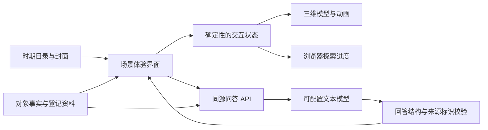

# “文化切片”项目设计 v0.10.1

更新日期：2026-09-30。本文对应当前实现；各场景的建模与历史实现补记保留在[整理前快照](archive/项目设计_整理前快照.md)和[迭代记录](迭代记录.md)。产品范围见[需求说明](需求说明.md)，验证条件与结果见[验证状态](验证状态.md)。

## 1. 总体架构

前端采用 React 19、TypeScript、Vite 7；三维采用 Three.js、React Three Fiber 与 Drei；服务端使用 Node.js 原生 HTTP 与 TypeScript。文化内容为本地结构化数据，进度保存在浏览器，无数据库或内容后台。



模型只生成解释，不执行场景动作或改变探索进度。当前 AI 根据登记内容与行为状态组织上下文，不读取实时画面、不进行网页检索，也没有向量检索、微调或自训练模型。

## 2. 模块职责

| 模块 | 主要文件 | 职责 |
|---|---|---|
| 目录与路由 | `catalog.ts`、`routes.ts`、`App.tsx`、`Timeline.tsx` | 九分组、27 场景、封面、直接入口与继续探索 |
| 原村落内容与状态 | `content.ts`、`state.ts`、`interaction.ts` | 六区域、十对象、放料与磨粮、状态恢复 |
| 原村落体验 | `Experience.tsx`、`Scene.tsx`、`placement.ts` | 三级观察、相机、手动磨粮与临时演示 |
| 新增切片内容 | `exhibits.ts`、分期 `exhibits*.ts`、各批 `*-expansion-content.ts` | 26 景、183 观察入口、79 有序步骤、来源与预置问答 |
| 新增切片体验 | `ExhibitExperience.tsx`、`exhibit-state.ts`、`ExhibitScene.tsx` | 共用界面、动作时钟、恢复、回顾、对象拾取与相机 |
| 独立场景 | `*Scene.tsx`、`*Scenes.tsx`、分期建筑及布局文件 | 各景模型、空间组合、动画和视点 |
| 建筑展开 | `BuildingReveal.tsx` | 屋面与围护展开、合拢及隐藏后的拾取控制 |
| AI 适配 | `server/chat.ts`、`server/config.ts` | 输入校验、上下文、模型配置、调用与输出过滤 |
| 本地 HTTP | `server/index.ts` | API、开发中间件、生产静态资源、错误响应 |
| 可选浏览器工具 | `useSceneTool.ts` | 原村落的只读状态工具，支持该浏览器能力时注册 |

不同切片共享低层构件、材质、界面与状态机制，建筑平面、地形和核心器物分别组织。完整背景不能仅通过换色或更换道具交付多个场景。

## 3. 三维、交互与资源加载

### 渲染与选择

使用程序化几何、自绘纹理及实例化控制资源体积和绘制开销。正交斜俯视相机提供旋转、缩放与对象聚焦；小物件可使用额外点击范围。DOM 名称提示不拦截指针，通常仅显示当前悬停或键盘聚焦对象。

原村落提供全景、区域、器物三级浏览，其他切片提供全景与对象聚焦。室内观察通过 `BuildingReveal` 等组件展开遮挡结构，隐藏对象禁用拾取，返回全景恢复完整围护。模型、聚焦坐标与动作完成后的落点须同步。

### 动画与状态

新增切片的 `ActionClock` 以可变时间推进，渲染层读取相位更新模型。React 管理开始、取消、完成等状态变化，完成后才追加动作 ID；取消、离场或卸载不提交过期完成。重放清空动作、保留观察，重置清除当前切片进度。

原村落放料由 `placement.ts` 的独立时钟推进，正常时长约 2.2 秒；隐藏页面暂停，跳过或减少动态设置可直接完成。磨粮通过拖动或方向键累加同一状态进度，自动演示使用定时器更新该进度。点火与泥条演示不记为核心步骤。

合成声在用户操作后创建 AudioContext；离场关闭音频。动画时长、合成音色、示意指法及模型尺度不作为历史测量数据。

### 懒加载与性能边界

`App.tsx` 静态加载时间轴，通过 React.lazy 按需加载原村落和新增切片体验。首页无 Canvas；进入后创建一个活动场景，离场卸载。后续进入可复用模块缓存，但重新创建场景并恢复稳定进度。

生产资源包括 PNG/WebP 封面、CSS 与 JavaScript。10 MB 的 gzip 预算对应全部静态资源估算，不等于首页或单场景的请求量；本地生产服务没有自动压缩。rAF 回调频率用于采样记录，不视为 GPU 帧时间或跨设备性能保证。

## 4. 内容与持久化契约

- `EraDefinition`：分组 ID、标题、排序、简介、问题和三个场景 ID。
- `SceneSummary`：场景 ID、所属分组、类别、标题、描述及 ready/planned 状态；当前 27 项均为 ready。
- 场景内容：对象、步骤、资料、预置问答与演绎边界。资料包含机构、标题、URL 和人工整理的事实摘要。
- 对象：稳定 ID、名称、类型、事实、详情、坐标及来源标识；空间入口也计为观察对象。

| 存储键 | 内容 |
|---|---|
| `culture-slice:progress:v1` | 原村落 entered、viewed、placed/ground 与加工进度 |
| `culture-slice:exhibit:<sceneId>:v1` | 新增切片 entered、viewed 和有序 actions |
| `culture-slice:last-scene:v1` | 最后进入的可玩场景 |
| `culture-slice:river-edition` | 汴河展示版本偏好 |

恢复时过滤未知对象、非法值和跳步，新增切片只接受最长连续动作前缀。场景之间的进度键独立，新增空间不自动标记为已观察。聊天保存在组件内存，刷新、重置或离场清除；临时动画不持久保存。

汴河 expanded/detailed 两版共享原场景进度；查询参数可分享展示版本。切版取消临时动作和客户端问答，清除对象选择并回到全景，不将切版解释为核心动作完成。

## 5. AI 配置、输入与输出

### 配置与状态

通用 `AI_API_URL`、`AI_API_KEY`、`AI_MODEL` 只要任一非空，就优先使用这一组；缺项不会借用 DeepSeek 密钥。三项均为空时，读取 `DEEPSEEK_API_KEY`，默认官方 chat-completions 地址和 `deepseek-flash`，可由 `DEEPSEEK_MODEL` 覆盖。默认名是当前代码配置，实际账户可用性需通过真实请求确认。

服务端读取进程环境及本地 `.env`，密钥不进入前端。`GET /api/status` 仅返回 `configured` 和公开提供商名称；configured 代表三项配置非空，不证明端点、凭据、模型或网络可用。

### 请求校验与上下文

浏览器提交同源 `POST /api/chat`：

```json
{"sceneId":"song-yuan-making","presentation":"expanded","zoneId":null,"objectId":"boat","actions":["structure","mast"],"question":"刚才为什么要倒桅？","history":[]}
```

- sceneId、objectId、区域与动作必须属于登记内容。新增切片不接受 zoneId，动作必须是该景步骤的连续前缀。
- 原村落允许 placed/ground，ground 必须以 placed 为前提；区域与对象必须匹配。
- presentation 仅供汴河 bridge 场景，接受 expanded/detailed。
- 问题为 1–1000 字符；历史最多八条，只接受 user/assistant，每条最多 3000 字符；HTTP 请求体最多 20 KB。
- 客户端不能提交资料正文。服务端从本地内容表取事实、来源摘要、当前对象与已完成操作；历史对话和问题作为待回答数据。

### 模型调用与错误

通用供应商使用 chat-completions 兼容格式：model、messages、temperature=0.3、max_tokens=900。DeepSeek 额外启用 JSON 输出并关闭思考。允许 HTTPS 端点；本地模型允许 loopback HTTP。服务端超时 **30 秒**，客户端超时 **35 秒**。

未完整配置时直接返回预置讲解，不调用模型。配置后发生网络、供应商或格式错误时返回可重试错误，不把供应商原始响应或凭据暴露给浏览器。此时不会自动把预置内容冒充在线模型回答。

```json
{"answer":"回答文本","sourceIds":["登记来源标识"],"mode":"live"}
```

回答须为非空字符串且不超过 3000 字符，sourceIds 须为数组；只保留当前允许的登记来源。无配置时 mode 为 preset。此校验不验证逐句事实，不保证来源能支撑回答，也不阻止所有提示注入，需按[AI 核查案例](AI核查案例.md)人工验收。

## 6. 部署与故障处理

开发模式复用 Vite 中间件；生产模式读取 build 生成的 dist。服务默认只监听本机 `127.0.0.1`，提供 API 与静态资源；部署命令见[README](../README.md)。当前仓库提供本机运行方式，未提供公开在线演示地址、打包安装器或账号系统。

- 无模型：场景、资料与预置讲解可用，自由问答明确未连接。
- 模型异常：显示错误与重试，探索进度保留。
- WebGL 不可用：提供静态说明和 DOM 对象、资料与操作入口。
- 存储不可用：本次体验继续，跨刷新恢复可能失效。
- 客户端离场中止请求；服务端模型调用仍以自身超时为界，不能据此声称上游推理同步停止。

面向公网部署需要另行实现或验证鉴权、调用配额、并发和成本控制。`read_culture_scene` 仅在原村落及支持相应能力的浏览器中注册，返回当前对象、区域和探索状态，不执行操作或调用模型；不作为所有切片的通用能力或验收前提。

## 7. 验证与后续工作

70 项单元/契约测试及类型、构建检查覆盖状态、内容和 API 的部分逻辑；CI 目前只执行依赖安装、测试和构建。浏览器流程、视觉质量、真实模型和用户效果需分别验证，记录见[验证状态](验证状态.md)。

后续以真实模型专项评测、目标用户试用、文化内容审读和低配兼容性为重点。当前本地原型不能据少量问答或短时高配采样推断应用成效及规模化运行能力。
